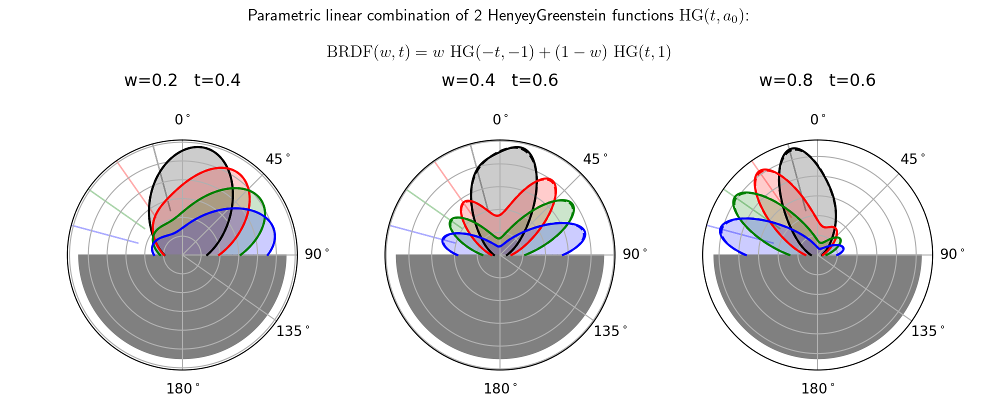
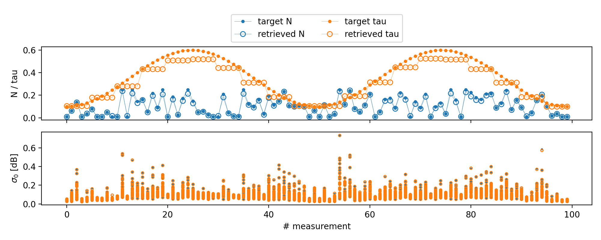

# Summary

The `rt1_model` package implements a generic solution to the radiative transfer equation applied to the problem of a rough surface covered by a tenuous distribution of particulate media as described in @Quast2016.

It provides a flexible, object-oriented interface to specify the scattering characteristics of the ground surface and the covering layer via parametric distribution functions.
The resulting model can then be evaluated to obtain backscattering-coefficient ($\sigma_0$) contributions for monostatic or bistatic measurement geometries up to first order as illustrated in Figure \ref{fig_model}. To speed up parameter retrieval stragegies, analytic estimates for the (zero-oder) Jacobian with respect to arbitrary model parameters are also provided.

The package utilizes a minimal set of core dependencies, namely: `numpy` @Harris2020, `scipy` @Virtanen2020, `sympy` @Meurer2017 (with optional `symengine` @symengine support) and a set of visualizations created with `matplotlib` @Hunter2007.


# Statement of need


Radiative transfer theory is used in a variety of contexts to retrieve biophysical characteristics from radar signals. The `rt1_model` package was developed to study soil-moisture retrievals from incidence-angle dependent backscatter measurements in the microwave-domain as provided by the ASCAT scatterometer onboard the METOP satellites @FigaSaldana2002 or synthetic aperture radar (SAR) instruments such as Sentinel-1 @Torres2012, or the upcoming NISAR @Rosen2021 mission. It represents a generalization of the widely used "water cloud model" @Attema1978 to provide an intuitive bi-static parameterization framework that can be evaluated up to first-order (e.g. double-bounce) contributions.

The RT1 modeling framework was used to perform soil-moisture retrievals from microwave c-band radar data @Quast2019, @Quast2023, @Brocca2024 and adapted to study rice-crop monitoring with a ground based bistatic scatterometer @Yadav2022.

The bi-static nature of the model parameterization strategy furthermore facilitates potential application to bi-static observations provided by Global Navigation Satellite Systems (GNSS) or satellite constellations such as SAOCOM @Scipal2017 or the upcoming Sentinel-1 companion mission Harmony @ESA2022.

## Parameterization strategy

To allow modelling of a wide variety of scattering characteristics for the ground surface and the covering layer, the package provides a set of distribution functions (Isotropic, Rayleigh, HenyeyGreenstein, ...). All functions are hereby implemented with respect to a generalized scattering angle @Lafortune1997 to support modelling of anisotropic effects.
In addition, parametric linear-combinations can be used to model more complex scenarios.

For example, to model a surface scattering behavior that consists of a peak in specular direction and a second peak in incidence direction, we can use a linear-combination of two HenyeyGreenstein functions:

```
from rt1_model import surface

SRF_1 = surface.HenyeyGreenstein(t="-t", a=[-1, 1, 1], ncoefs=12)
SRF_2 = surface.HenyeyGreenstein(t="t",  a=[ 1, 1, 1], ncoefs=12)
SRF = surface.LinComb([("w", SRF_1), ("1-w", SRF_2)])
```



## Parameter Retrieval

To show potential applications of the `rt1_model` package to perform forward-simulations as well as parameter retrievals from monostatic measurements, the documentation provides several examples on how to use the package in conjunction with non-linear least squares regression optimization provided by `scipy.optimize`.

Examples hereby show how to perform "static" parameter retrievals (Figure \ref{fig_retrieval_static}) as well as multi-temporal timeseries optimization (Figure \ref{fig_retrieval_multi_temporal})).

The provided analyzer-widget can then be used to assess effects of model parameters on the individual backscattering contributions.




# References
