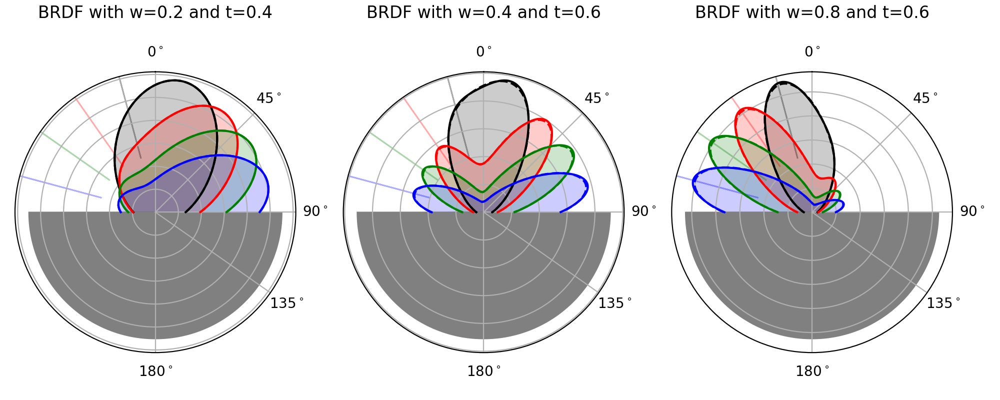

# Summary

The `rt1_model` package implements a generic solution to the radiative transfer equation applied to the problem of a rough surface covered by a tenuous distribution of particulate media as described in @Quast2016.

It provides a flexible, object-oriented interface to specify the scattering characteristics of the ground surface and the covering layer via parametric distribution functions and to evaluate the resulting backscattering-coefficient ($\sigma_0$) for monostatic or bistatic measurement geometries as illustrated in Figure \ref{fig_model}.

The underlying calculations are implemented via symbolic expressions, allowing the user to create fully customized model parameterizations. To speed up parameter retrieval stragegies, analytic solutions for the Jacobian of arbitrary model parameters are provided.

The package utilizes a minimal set of core dependencies, namely: `numpy` @Harris2020, `scipy` @Virtanen2020, `sympy` @Meurer2017 (with optional `symengine` @symengine support) and a set of visualizations created with `matplotlib` @Hunter2007.


# Statement of need


Radiative transfer theory is used in a variety of contexts to retrieve biophysical characteristics from radar signals. The `rt1_model` package was developed to study soil-moisture retrievals from incidence-angle dependent backscatter measurements in the microwave-domain, provided for example by the ASCAT scatterometer onboard the METOP satellites @FigaSaldana2002 or synthetic aperture radar (SAR) instruments such as Sentinel-1 @Torres2012, or the upcoming NISAR @Rosen2021 mission.

To date, the RT1 modeling framework was used for soil-moisture retrieval from microwave c-band radar data @Quast2019, @Quast2023 and adapted for rice-crop monitoring with a ground based bistatic scatterometer @Yadav2022.

The bi-static nature of the distribution functions used in the parametrization of soil- and vegetation characteristics furthermore enables potential application to bi-static measurements as provided by GNSS systems or constellations such as SAOCOM @Scipal2017 or the upcoming Sentinel-1 companion mission Harmony @ESA2022.


## Distribution functions

The package provides a set of distribution functions (Isotropic, Rayleigh, HenyeyGreenstein, ...) that can be used to describe basic volume- or surface scatternig behaviors. More complex scattering scenarios can then be modelled by utilizing parametric linear-combinations.

To support possibly anisotropic scattering characteristics, all functions are furthermore implemented with respect to a generalized scattering angle @Lafortune1997:

$$\cos(\Theta_a) = a_0 \cos(\theta) \cos(\theta_s) + \sin(\theta)\sin(\theta_s) [ a_1 \cos(\phi)\cos(\phi_s) + a_2 \sin(\phi) \sin(\phi_s)]$$

where ($\theta, \phi$) denote the incident azimuth and polar angle and $(\theta_s, \phi_s)$ the corresponding exit angles and $(a_0, a_1, a_2)$ are the generalization parameters.

For example, a surface scattering distribution function that consists of a peak in specular direction and a second peak in incidence direction can be defined as:

$$BRDF = w * HG(-t, a_0=-1) + (1-w) * HG(t, a_0=1) \quad \textrm{with} \quad w, t \in (0,1)$$

and implemented via:

```
from rt1_model import surface

SRF_1 = surface.HenyeyGreenstein(t="-t", a=[-1, 1, 1], ncoefs=12)
SRF_2 = surface.HenyeyGreenstein(t="t",  a=[ 1, 1, 1], ncoefs=12)
SRF = surface.LinComb([("w", SRF_1), ("1-w", SRF_2)])
```




## Parameter Retrieval

The documentation provides a set of retrieval examples...


# References
